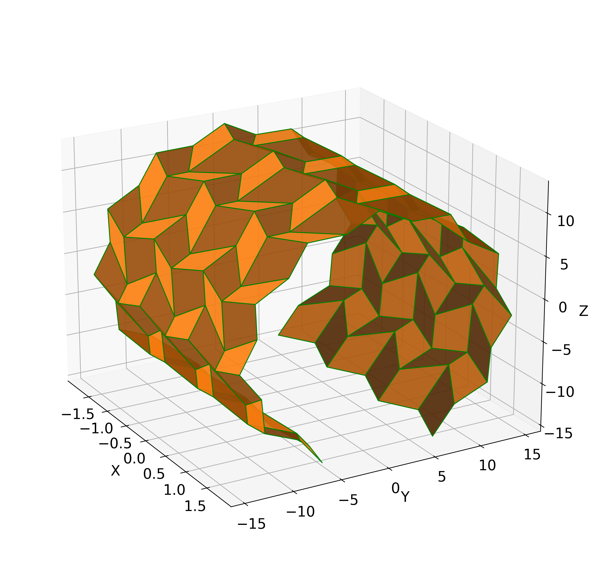
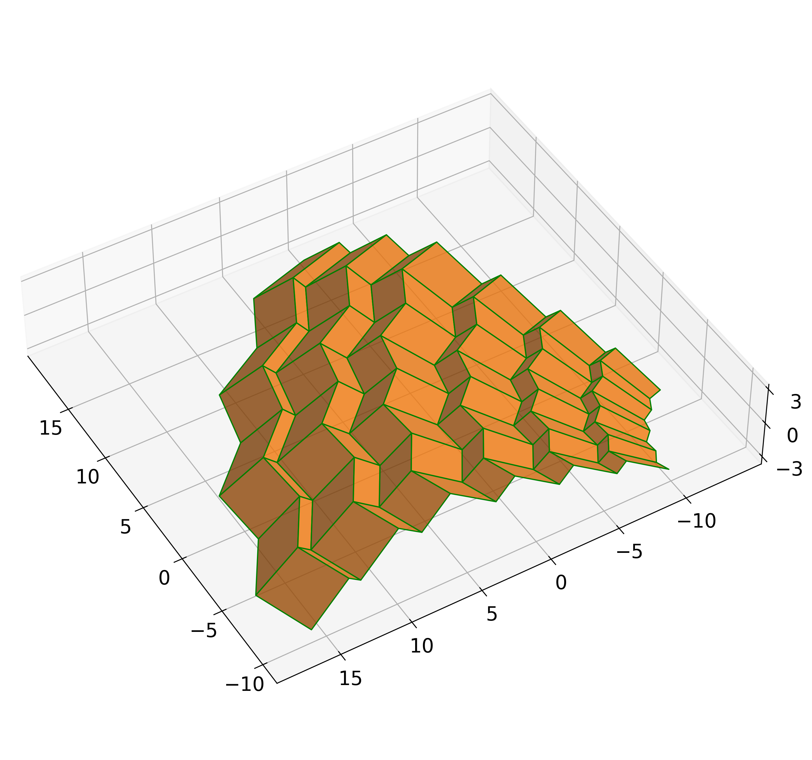
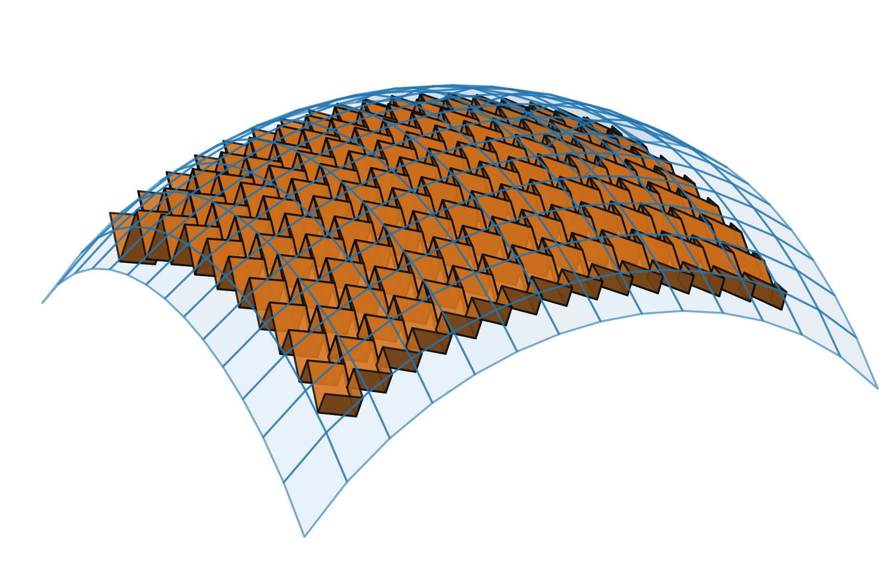
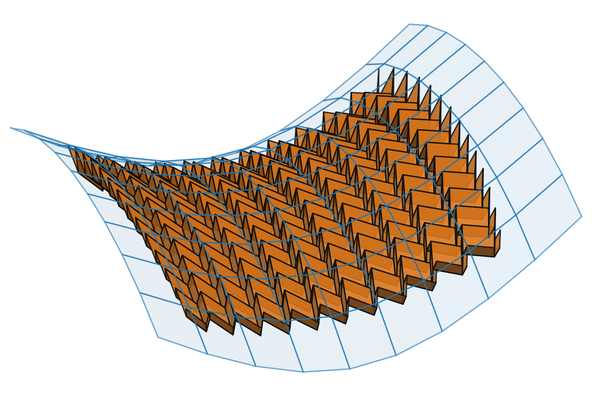
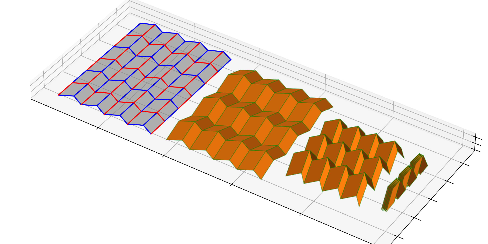

# Origami

Utility for generating and folding *rigidly and flat-foldable quadrilateral mesh (RFFQM) origami*.

|  |  |
|-----------------------------------------------------|-----------------------------------------------------------|
|    |                 |


## Installation

Download the package and run
```bash
python setup.py
```

## Usage
The most common usage is to create an RFFQM crease pattern 
by dictating the boundary input data and solving the marching algorithm.
Then the pattern can be rigidly folded.

```python
import numpy as np

from origami import marchingalgorithm, quadranglearray, RFFQMOrigami, origamiplots

angle = 0.7 * np.pi  # The base angle of the Miura-Ori
ls = np.ones(10)  # The lengths for the left boundary vertical creases
cs = np.ones(10)  # The lengths for the bottom boundary horizontal creases

# Create the boundary angles for classical Miura-Ori
angles_left, angles_bottom = marchingalgorithm.create_miura_angles(ls, cs, angle)

# Here we can add perturbations to the lengths and to the angles by setting
# ls, cs, angles_left, angles_bottom

# Here the marching algorithm is applied to calculate the angles along the crease pattern
marching = marchingalgorithm.MarchingAlgorithm(angles_left, angles_bottom)
# Here the marching algorithm is applied to create the crease pattern based on the given boundary lengths
dots, indexes = marching.create_dots(ls, cs)

# QuadrangleArray is a data structure that handles quadrangle mesh objects
quads = quadranglearray.dots_to_quadrangles(dots, indexes)
ori = RFFQMOrigami.RFFQM(quads)  # The origami object allows the folding of the given flat crease pattern

# Plot with an interactive slider for the folding angle 
origamiplots.plot_interactive(ori)
```
